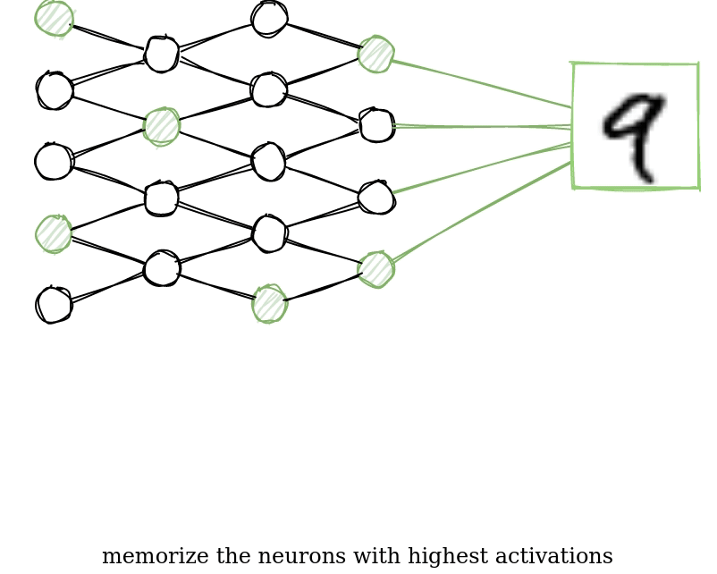

# Object classification without gradient descent

Inspired by the Hippocampus of the human brain, this small project tries to learn to classify images similarly.
The neurons in our brain create connections when they frequently fire synchronously.
These connections may lead to the fact that when one of these neurons gets stimulated, all the other connected neurons may be stimulated as well.

## Method

1. Feed each digit from the training dataset separately to the network and sum the neuron activations.
2. Find the neurons with the highest activations and store their indices (neuron group)
3. Feed a sample from the test dataset and check which neuron group has the highest sum of activations.
